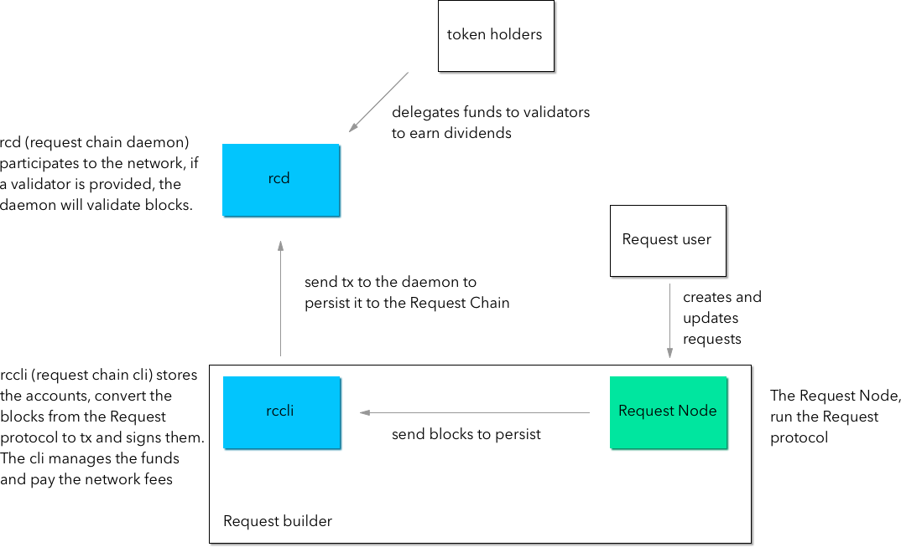

# Request Chain

Request Chain is a Delegated Proof of Stake blockchain based on Cosmos used as an example of the storage layer of the Request protocol

A Cosmos blockchain is a Delegated Proof of stake blockchain. Users delegate their fund to validators that will run the blockchain. The Request protocol will store the blocks to Request Chain and pay a fee that will be sent to the delegators and validators.

This version is a PoC


### How does it works

This repo contains the modules `rcd` and `rccli`



### Implementation of the storage layer

The new storage layer of Request protocol send API request to the rccli server.

[github.com/ltacker/request-chain-storage](https://github.com/ltacker/request-chain-storage)


### Testing

A fork of the Request Node has been created to use the new storage layer.

[github.com/ltacker/request-node](https://github.com/ltacker/request-node)

This repo contains a docker-compose file that simulates a network with one validator and two, well funded, accounts. The network can be launched with the command:

```
docker-compose up
```

Then, you can create and update request with [request-client.js](https://github.com/RequestNetwork/requestNetwork/tree/master/packages/request-client.js) to the node running on `localhost:3000`


### TODO

- Update to Cosmos SDK latest version
- Implement Pegzone for ERC20 to allows usage of the REQ token to pay fees
